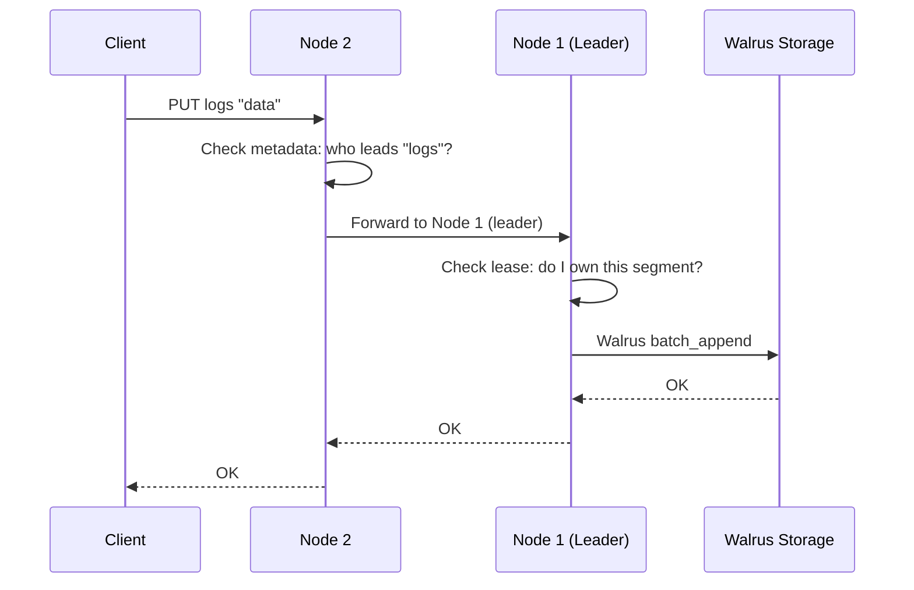
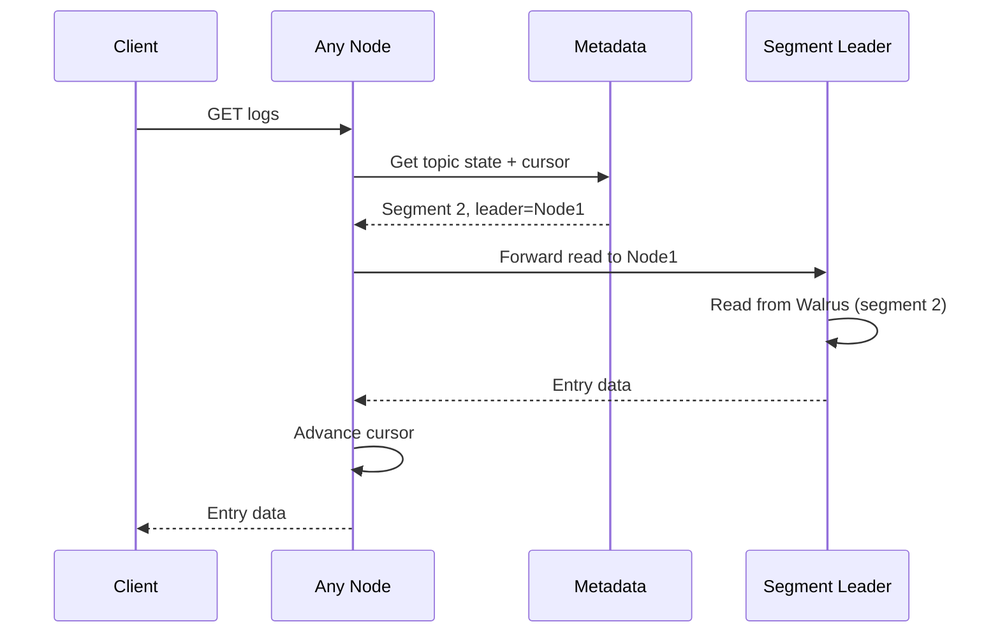

## Introduction

Distributed Walrus transforms the single-node Walrus storage engine into a fault-tolerant, distributed streaming log system. It combines Walrus's high-performance write-ahead logging with Raft consensus to provide automatic load balancing, fault tolerance, and seamless horizontal scaling.

## What is Distributed Walrus?

Distributed Walrus is a distributed log streaming engine built on top of the Walrus storage engine. It provides:

- **Automatic load balancing** via segment-based leadership rotation
- **Fault tolerance** through Raft consensus (3+ nodes minimum)
- **Simple client protocol** - connect to any node, auto-forwarding handles routing
- **Sealed segments** for historical reads from any replica
- **Consensus on metadata only** - data path remains fast and direct

<Note>
Unlike standalone Walrus which runs on a single machine, Distributed Walrus coordinates multiple nodes to provide redundancy and automatic failover.
</Note>

## Architecture Overview

### High-Level System Design

```
                    Producers & Consumers
                            │
                    ┌───────┴────────┐
                    │  Load Balancer │  (optional)
                    └───────┬────────┘
                            │
        ┌───────────────────┼───────────────────┐
        │                   │                   │
    ┌───▼────┐         ┌────▼───┐         ┌────▼───┐
    │ Node 1 │◄───────►│ Node 2 │◄───────►│ Node 3 │
    │ :9091  │  Raft   │ :9092  │  Raft   │ :9093  │
    └────────┘  :6001  └────────┘  :6002  └────────┘
```

Clients can connect to any node in the cluster. The cluster automatically:
- Routes writes to the current segment leader
- Serves reads from the appropriate node (leader for active segment, original leader for sealed segments)
- Rotates leadership across nodes as segments fill up

### Core Components

Each node in the cluster contains four key components:

<CardGroup cols={2}>
  <Card title="Node Controller" icon="route">
    Routes client requests to appropriate segment leaders, manages write leases, tracks logical offsets, and forwards operations to remote leaders when needed.
  </Card>
  
  <Card title="Raft Engine (Octopii)" icon="users">
    Maintains consensus for metadata changes only (not data). Handles leader election and log replication. Syncs metadata across all nodes via AppendEntries RPCs.
  </Card>
  
  <Card title="Cluster Metadata" icon="database">
    Raft state machine storing topic → segment → leader mappings, sealed segments with entry counts, and node addresses for routing. Replicated identically across all nodes.
  </Card>
  
  <Card title="Bucket Storage" icon="hard-drive">
    Wraps Walrus engine with lease-based write fencing. Only accepts writes if node holds lease for that segment. Stores actual data in Walrus WAL files on disk.
  </Card>
</CardGroup>

## Key Differences from Standalone Walrus

| Aspect | Standalone Walrus | Distributed Walrus |
|--------|-------------------|-------------------|
| **Deployment** | Single process/machine | 3+ node cluster |
| **Fault Tolerance** | Process restart only | Automatic failover |
| **Coordination** | None required | Raft consensus for metadata |
| **Load Distribution** | All on one node | Automatic via segment rotation |
| **Network Ports** | Storage only | Client (:9091-9093) + Raft (:6001-6003) |
| **Write Path** | Direct to storage | Leader-based with forwarding |
| **Read Path** | Local only | Can read from any node with the data |
| **Segment Management** | Manual or time-based | Automatic rollover and leader rotation |

## How Data Flows Through the System

### Write Path



1. Client connects to any node (Node 2)
2. Node 2 checks metadata to determine leader (Node 1)
3. Node 2 forwards write to Node 1 via RPC
4. Node 1 verifies it holds the write lease
5. Node 1 writes to local Walrus storage
6. Response flows back to client

<Note>
If the client had connected directly to Node 1 (the leader), steps 2-3 would be skipped for lower latency.
</Note>

### Read Path with Cursor Management



The system maintains a shared cursor per topic that automatically advances across segments as they're sealed.

### Metadata Replication via Raft

All cluster state changes (topic creation, segment rollovers, node additions) go through Raft consensus:

```
Node monitors segment size → Proposes rollover command → Raft consensus
    → All nodes update metadata → Lease sync (100ms) → New leader active
```

## Segment-Based Partitioning

Topics are divided into segments, with each segment having a single leader node responsible for writes:

```
Topic: "logs"
├── Segment 1: 1,000,000 entries (sealed) → Leader: Node 1
├── Segment 2: 950,000 entries (sealed)   → Leader: Node 2  
└── Segment 3: 150,000 entries (active)   → Leader: Node 3
```

**Segment lifecycle:**

1. **Active segment**: Current segment accepting writes, owned by leader node
2. **Rollover trigger**: Monitor detects segment has exceeded threshold (default: 1M entries)
3. **Seal operation**: Raft commits metadata change to seal segment with final entry count
4. **Leadership transfer**: New segment created with next node as leader (round-robin)
5. **Sealed segment**: Read-only, served by original leader node

<Check>
Sealed segments never move between nodes. The original leader retains the data for reads, eliminating data migration overhead.
</Check>

## Lease-Based Write Fencing

Write safety is enforced through a lease system:

- Only the leader node for a segment can write to it
- Leases are derived from Raft-replicated metadata
- 100ms sync loop ensures lease consistency across nodes
- Prevents split-brain writes during leadership changes

**Lease sync flow:**

```rust
// Every 100ms on each node:
1. Query local Raft metadata for owned segments
2. Expected leases: ["logs:3", "metrics:2"] 
3. Update storage layer with expected set
4. Storage accepts writes only for leased segments
```

During a rollover:
- **Old leader**: Next sync removes lease → writes fail with `NotLeaderError`
- **New leader**: Next sync grants lease → starts accepting writes
- **Maximum inconsistency window**: 100ms

## Network Topology

### Port Layout

- **Client ports (`:9091-9093`)**: TCP connections for `REGISTER`, `PUT`, `GET`, `STATE`, `METRICS`
- **Raft ports (`:6001-6003`)**: Internal RPC for metadata sync and node-to-node forwarding

### Communication Patterns

1. **Client ↔ Node**: Length-prefixed text protocol over TCP
2. **Node ↔ Node (Data)**: Internal RPC for forwarding writes/reads to segment leaders
3. **Node ↔ Node (Metadata)**: Raft consensus via AppendEntries and RequestVote RPCs

## Monitoring and Observability

### STATE Command

Query topic metadata to understand segment distribution:

```bash
$ walrus-cli state logs
```

```json
{
  "current_segment": 3,
  "leader_node": 1,
  "last_sealed_entry_offset": 1950000,
  "sealed_segments": {
    "1": 1000000,
    "2": 950000
  },
  "segment_leaders": {
    "1": 2,
    "2": 3,
    "3": 1
  }
}
```

### METRICS Command

Inspect Raft cluster health:

```bash
$ walrus-cli metrics
```

Returns Raft metrics including current leader, log index, membership configuration, and node states.

## Next Steps

<CardGroup cols={2}>
  <Card title="Deployment Guide" icon="rocket" href="/cluster/deployment">
    Learn how to deploy a 3-node cluster with Docker or manually
  </Card>
  
  <Card title="Client Protocol" icon="code" href="/cluster/client-protocol">
    Understand the TCP protocol and available commands
  </Card>
  
  <Card title="Segment Management" icon="layer-group" href="/cluster/segment-management">
    Deep dive into segment rollover and lease mechanics
  </Card>
  
  <Card title="Failure Recovery" icon="life-ring" href="/cluster/failure-recovery">
    Handle node failures and recovery procedures
  </Card>
</CardGroup>
