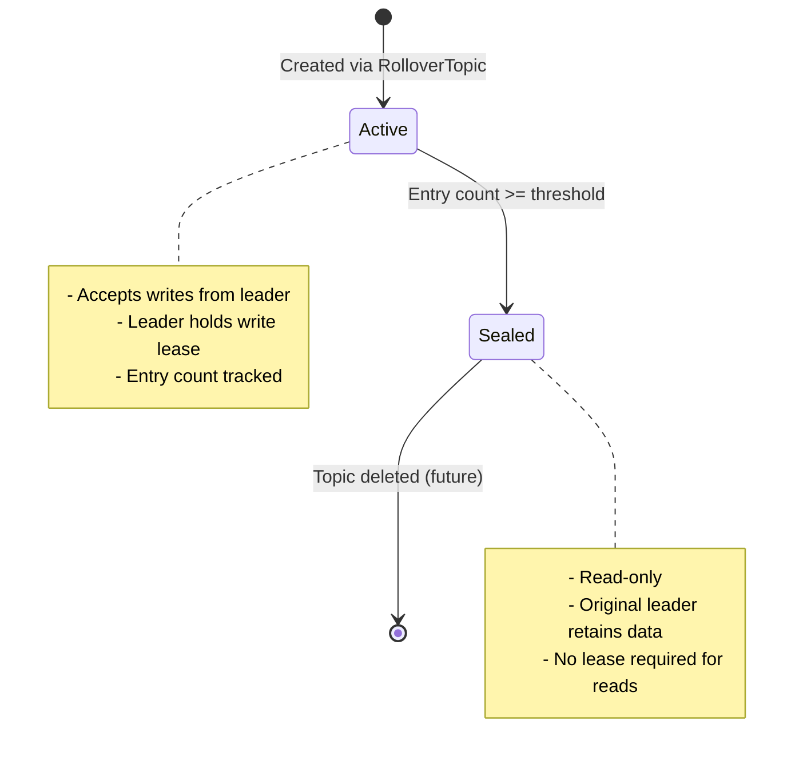

## Overview

Distributed Walrus partitions topics into segments to enable horizontal scaling and load distribution. Each segment has a single leader node that accepts writes, and the system automatically rotates leadership across nodes as segments fill up.

## Segment Basics

### What is a Segment?

A segment is a logical partition of a topic's log, stored physically as a Walrus WAL file on disk.

**Properties:**
- **Unique identifier**: `<topic>:<segment_id>` (e.g., `logs:1`, `logs:2`)
- **Entry-based sizing**: Rolls over after a threshold number of entries (default: 1M)
- **Single writer**: Only the leader node can append to the active segment
- **Immutable when sealed**: Once rolled over, segments become read-only

**Example topic structure:**

```
Topic: "events"
├── Segment 1: events:1 (sealed, 1,000,000 entries) → Leader: Node 2
├── Segment 2: events:2 (sealed, 1,000,000 entries) → Leader: Node 3
├── Segment 3: events:3 (sealed, 1,000,000 entries) → Leader: Node 1
└── Segment 4: events:4 (active, 450,000 entries)   → Leader: Node 2
```

### Segment Lifecycle



<Steps>
  <Step title="Segment Created">
    Raft commits `RolloverTopic` command, metadata updated with new segment ID and leader assignment.
  </Step>
  
  <Step title="Active Writes">
    Leader node accepts PUTs, appends to Walrus, tracks entry count. Lease sync ensures only leader can write.
  </Step>
  
  <Step title="Threshold Reached">
    Monitor loop detects `entry_count >= WALRUS_MAX_SEGMENT_ENTRIES` (default: 1M).
  </Step>
  
  <Step title="Rollover Proposed">
    Current leader proposes `RolloverTopic` with final entry count and next leader assignment.
  </Step>
  
  <Step title="Segment Sealed">
    Raft commits rollover. Metadata marks segment as sealed with entry count. Old leader's lease is revoked.
  </Step>
  
  <Step title="New Segment Active">
    New leader gains lease for new segment. Writes route to new leader. Old segment remains readable from original leader.
  </Step>
</Steps>

## Automatic Rollover

Rollover is triggered automatically by the monitor loop running on each node.

### Monitor Loop

**Location:** `src/monitor.rs:Monitor::run()`

**Configuration:**
```bash
# Check interval (default: 10 seconds)
export WALRUS_MONITOR_CHECK_MS=10000

# Rollover threshold (default: 1 million entries)
export WALRUS_MAX_SEGMENT_ENTRIES=1000000
```

**Algorithm:**

```rust
async fn check_rollovers(&self) -> Result<()> {
    // 1. Get all segments this node leads
    let owned = self.metadata.owned_topics(self.node_id);
    
    for (topic, segment) in owned {
        let wal_key = format!("{}:{}", topic, segment);
        
        // 2. Check tracked entry count
        let entries = self.controller.tracked_entry_count(&wal_key).await;
        
        // 3. Trigger rollover if threshold exceeded
        if entries >= max_segment_entries() {
            // 4. Select next leader (round-robin)
            let voters = self.get_raft_voters();
            let current_idx = voters.iter().position(|&id| id == self.node_id)?;
            let next_leader = voters[(current_idx + 1) % voters.len()];
            
            // 5. Propose rollover via Raft
            let cmd = MetadataCmd::RolloverTopic {
                name: topic,
                new_leader: next_leader,
                sealed_segment_entry_count: entries,
            };
            self.controller.propose_metadata(cmd).await?;
        }
    }
    Ok(())
}
```

**Key points:**
- Only the current leader monitors its own segments
- Entry counts are tracked in-memory (`controller.offsets`)
- Rollover is a metadata operation (Raft consensus required)
- Leadership rotates round-robin through voting members

### Rollover Execution

When a `RolloverTopic` command is committed to Raft:

**Metadata changes:**

```rust
// Before rollover
TopicState {
    current_segment: 2,
    leader_node: 1,
    sealed_segments: {1: 1000000},
    segment_leaders: {1: 3, 2: 1},
}

// After RolloverTopic(name="logs", new_leader=2, sealed_count=1000050)
TopicState {
    current_segment: 3,              // Incremented
    leader_node: 2,                  // Changed to next leader
    sealed_segments: {
        1: 1000000,
        2: 1000050,                  // Added
    },
    segment_leaders: {
        1: 3,
        2: 1,                        // Preserved (original leader)
        3: 2,                        // New mapping
    },
}
```

**Source:** `src/metadata.rs:Metadata::apply()` (lines 144-164)

<Accordion title="View Source Code">
```rust
MetadataCmd::RolloverTopic {
    name,
    new_leader,
    sealed_segment_entry_count,
} => {
    if let Some(topic_state) = state.topics.get_mut(&name) {
        let sealed_seg = topic_state.current_segment;
        
        // Record sealed segment with final count
        topic_state
            .sealed_segments
            .insert(sealed_seg, sealed_segment_entry_count);
        
        // Preserve original leader for reads
        topic_state
            .segment_leaders
            .insert(sealed_seg, topic_state.leader_node);
        
        // Update cumulative offset
        topic_state.last_sealed_entry_offset += sealed_segment_entry_count;
        
        // Advance to next segment
        topic_state.current_segment += 1;
        topic_state.leader_node = new_leader;
        
        // Record new leader
        topic_state
            .segment_leaders
            .insert(topic_state.current_segment, new_leader);
        
        return Ok(Bytes::from_static(b"ROLLED"));
    }
    Err("Topic not found".into())
}
```
</Accordion>

## Lease-Based Write Fencing

Leases prevent split-brain writes during leadership transitions.

### Why Leases?

Without leases, two nodes might both believe they're the leader for a segment:

```
❌ Without leases:
   Node 1: "I'm leader for logs:1" → Writes to Walrus
   Node 2: "I'm leader for logs:1" → Writes to Walrus
   Result: Corrupted log, ordering violations
```

With leases:

```
✅ With leases:
   Node 1: Has lease for logs:1 → Writes succeed
   Node 2: No lease for logs:1  → Writes rejected with NotLeaderError
```

### Lease Lifecycle

**Location:** `src/bucket.rs:Storage::update_leases()`

**Lease sync loop (every 100ms):**

```rust
// On each node:
async fn run_lease_update_loop(self: Arc<Self>) {
    let mut interval = tokio::time::interval(Duration::from_millis(100));
    loop {
        interval.tick().await;
        
        // 1. Query metadata for owned segments
        let owned = self.metadata.owned_topics(self.node_id);
        
        // 2. Convert to wal_keys
        let expected: HashSet<String> = owned
            .into_iter()
            .map(|(topic, seg)| format!("{}:{}", topic, seg))
            .collect();
        
        // 3. Update storage layer
        self.bucket.update_leases(&expected).await;
    }
}
```

**Source:** `src/controller/mod.rs:NodeController::run_lease_update_loop()` (lines 284-290)

**Storage enforcement:**

```rust
async fn append_by_key(&self, wal_key: &str, data: Vec<u8>) -> Result<()> {
    // 1. Acquire lease guard (fails if no lease)
    let _guard = BucketGuard::lock(self, wal_key).await?;
    
    // 2. Write to Walrus (only reached if lease held)
    self.engine.batch_append_for_topic(wal_key, &[&data])?;
    Ok(())
}

async fn ensure_lease(&self, wal_key: &str) -> Result<()> {
    let leases = self.active_leases.read().await;
    if !leases.contains(wal_key) {
        bail!("NotLeaderForPartition: {}", wal_key);
    }
    Ok(())
}
```

**Source:** `src/bucket.rs:Storage::append_by_key()` (lines 44-51)

### Lease Transition Timeline

During a rollover from Node 1 to Node 2 for segment `logs:2` → `logs:3`:

```
T=0ms:    Monitor on Node 1 proposes RolloverTopic
T=10ms:   Raft consensus achieved, metadata committed
T=10ms:   All nodes' metadata now shows:
            - logs:2 sealed (leader: Node 1)
            - logs:3 active (leader: Node 2)

T=0-100ms: Lease sync hasn't run yet
            - Node 1: Still has lease for logs:2 ✅
            - Node 2: No lease for logs:3 yet ❌
            - Writes to logs:3 fail temporarily

T=100ms:  Lease sync on Node 1
            - owned_topics(1) = [] (no longer owns anything)
            - Lease for logs:2 REVOKED
            - Future writes to logs:2 fail

T=100ms:  Lease sync on Node 2
            - owned_topics(2) = [("logs", 3)]
            - Lease for logs:3 GRANTED
            - Node 2 starts accepting writes

T=110ms+: System fully transitioned
            - Node 1: Can serve reads from sealed logs:2
            - Node 2: Accepts writes to active logs:3
```

<Warning>
**Grace period**: 0-100ms window where the new leader hasn't acquired the lease yet. Clients will receive `NotLeaderError` and should retry.
</Warning>

### Per-Key Write Locks

In addition to leases, each segment has a per-key mutex to prevent concurrent writes:

```rust
// Storage maintains per-wal_key mutexes
write_locks: RwLock<HashMap<String, Arc<Mutex<()>>>>

async fn append_by_key(&self, wal_key: &str, data: Vec<u8>) {
    // 1. Check lease
    self.ensure_lease(wal_key).await?;
    
    // 2. Acquire per-key mutex
    let lock = self.lock_for_key(wal_key).await;
    let _guard = lock.lock_owned().await;
    
    // 3. Write (serialized per segment)
    self.engine.batch_append_for_topic(wal_key, &[&data])?;
}
```

**Purpose:**
- Prevents concurrent writes to the same segment from different threads
- Ensures total order of entries within a segment
- Complements lease-based fencing (leases prevent cross-node conflicts, mutexes prevent intra-node conflicts)

## Leadership Rotation

Leadership rotates round-robin through voting members to distribute load.

### Rotation Algorithm

```rust
// Get Raft voting members
let voters = raft.raft_metrics().membership_config.voters();
// Example: [1, 2, 3]

// Find current node's position
let current_idx = voters.iter().position(|&id| id == self.node_id)?;
// If node_id=2, current_idx=1

// Calculate next leader
let next_leader = voters[(current_idx + 1) % voters.len()];
// (1 + 1) % 3 = 2 → next_leader = voters[2] = 3
```

**Source:** `src/monitor.rs:Monitor::check_rollovers()` (lines 116-125)

### Example Rotation Sequence

**Initial state:**
- Topic: `logs`
- Voters: [1, 2, 3]

| Segment | Leader | Entries | Status |
|---------|--------|---------|--------|
| 1 | Node 1 | 1,000,000 | Sealed |
| 2 | Node 2 | 1,000,000 | Sealed |
| 3 | Node 3 | 1,000,000 | Sealed |
| 4 | Node 1 | 1,000,000 | Sealed |
| 5 | Node 2 | 450,000 | Active |

**After Node 2 triggers rollover for segment 5:**

| Segment | Leader | Entries | Status |
|---------|--------|---------|--------|
| 1 | Node 1 | 1,000,000 | Sealed |
| 2 | Node 2 | 1,000,000 | Sealed |
| 3 | Node 3 | 1,000,000 | Sealed |
| 4 | Node 1 | 1,000,000 | Sealed |
| 5 | Node 2 | 1,000,050 | Sealed |
| 6 | Node 3 | 0 | Active ← New |

**Load distribution:**
- Each node handles writes for 1/3 of the time
- All nodes can serve reads from their sealed segments
- Balanced over time as segments roll over

### Hot-Join Impact

When a new node joins, it participates in future rotations:

```
Before Node 4 joins:  [1, 2, 3] → Rotation: 1→2→3→1...
After Node 4 joins:   [1, 2, 3, 4] → Rotation: 1→2→3→4→1...
```

**New segment created after join:**
- Segment 10 leader: Node 1 (rotation continues from where it was)
- Segment 11 leader: Node 2
- Segment 12 leader: Node 3
- Segment 13 leader: Node 4 ← First time Node 4 leads

<Info>
Existing segments don't migrate. Node 4 only starts leading new segments created after it joins.
</Info>

## Segment Reads

### Reading Sealed Segments

Sealed segments are served by their original leader:

```rust
async fn read_one_for_topic(&self, topic: &str, cursor: &mut ReadCursor) {
    let topic_state = self.metadata.get_topic_state(topic)?;
    
    // Determine which segment cursor is on
    if cursor.segment < topic_state.current_segment {
        // Sealed segment
        let leader = self.metadata.segment_leader(topic, cursor.segment)?;
        // leader = original node that wrote this segment
        
        if leader == self.node_id {
            // Read locally
            self.bucket.read_one(&wal_key).await?
        } else {
            // Forward read to original leader
            self.forward_read_remote(leader, wal_key).await?
        }
    } else {
        // Active segment, read from current leader
        let leader = topic_state.leader_node;
        // ...
    }
}
```

**Source:** `src/controller/mod.rs:NodeController::read_one_for_topic()` (lines 199-268)

**Key insight:**
- No data movement required during rollover
- Sealed segments stay on original node
- Reads fan out to multiple nodes for historical data

### Cursor Advancement Logic

```rust
struct ReadCursor {
    segment: u64,              // 1, 2, 3, ...
    delivered_in_segment: u64, // Entries read from current segment
}

// Advancement rules:
if data.is_empty() {
    if segment < current_segment {
        // Sealed segment exhausted
        let sealed_count = metadata.sealed_count(topic, segment)?;
        if delivered_in_segment >= sealed_count {
            cursor.segment += 1;
            cursor.delivered_in_segment = 0;
            continue; // Try next segment
        }
    }
    return None; // No more data available
} else {
    cursor.delivered_in_segment += 1;
    return Some(data);
}
```

**Example progression:**

```
Initial:  {segment: 1, delivered: 0}
Read 1:   {segment: 1, delivered: 1} → Returns entry
Read 2:   {segment: 1, delivered: 2} → Returns entry
...
Read 1M:  {segment: 1, delivered: 1000000} → Returns entry
Read 1M+1: {segment: 1, delivered: 1000000}
           Sealed count = 1000000
           delivered >= sealed_count → Advance
           {segment: 2, delivered: 0} → Try segment 2
```

## Monitoring Segment Health

### Using STATE Command

```bash
$ walrus-cli state logs
```

```json
{
  "current_segment": 5,
  "leader_node": 2,
  "sealed_segments": {
    "1": 1000000,
    "2": 1000000,
    "3": 1000000,
    "4": 1000050
  },
  "segment_leaders": {
    "1": 3,
    "2": 1,
    "3": 2,
    "4": 3,
    "5": 2
  }
}
```

**Analysis:**
- **Load distribution**: Leaders 1, 2, 3, 2, 3 → fairly balanced
- **Total entries**: 1000000 + 1000000 + 1000000 + 1000050 = 3,001,050 sealed + segment 5 (active)
- **Rollover frequency**: 4 rollovers = 4M entries / 4 = 1M per rollover (as expected)

### Disk Usage

Check storage per node:

```bash
$ du -sh data/node_*/user_data
512M    data/node_1/user_data
498M    data/node_2/user_data
503M    data/node_3/user_data
```

**Interpretation:**
- Node 1 has more data: likely led more segments historically
- Data is NOT evenly distributed (sealed segments don't migrate)
- Over time, distribution converges as rotation continues

## Tuning Segment Size

### Adjusting Rollover Threshold

```bash
# Smaller segments = more frequent rollovers = better load distribution
export WALRUS_MAX_SEGMENT_ENTRIES=100000

# Larger segments = less metadata overhead = fewer leadership changes
export WALRUS_MAX_SEGMENT_ENTRIES=10000000
```

**Trade-offs:**

| Threshold | Pros | Cons |
|-----------|------|------|
| Small (10K) | Rapid load distribution, fine-grained failover | High metadata churn, more Raft commits |
| Medium (1M) | Balanced (default) | Moderate |
| Large (10M) | Low overhead, stable leadership | Slow load balancing, coarse failover |

<Tip>
For write-heavy workloads with many nodes, lower the threshold (e.g., 100K) to distribute load faster. For read-heavy workloads, use larger segments to reduce metadata overhead.
</Tip>

### Monitor Interval

```bash
# Check for rollover more frequently
export WALRUS_MONITOR_CHECK_MS=5000

# Check less frequently (lower overhead)
export WALRUS_MONITOR_CHECK_MS=30000
```

**Recommendation:**
- Production: 10-30 seconds (balance between responsiveness and overhead)
- Development/testing: 1-5 seconds (faster rollovers for testing)

## Next Steps

<CardGroup cols={2}>
  <Card title="Failure Recovery" icon="life-ring" href="/cluster/failure-recovery">
    Handle node failures and segment availability
  </Card>
  
  <Card title="Client Protocol" icon="code" href="/cluster/client-protocol">
    Return to protocol details
  </Card>
</CardGroup>
